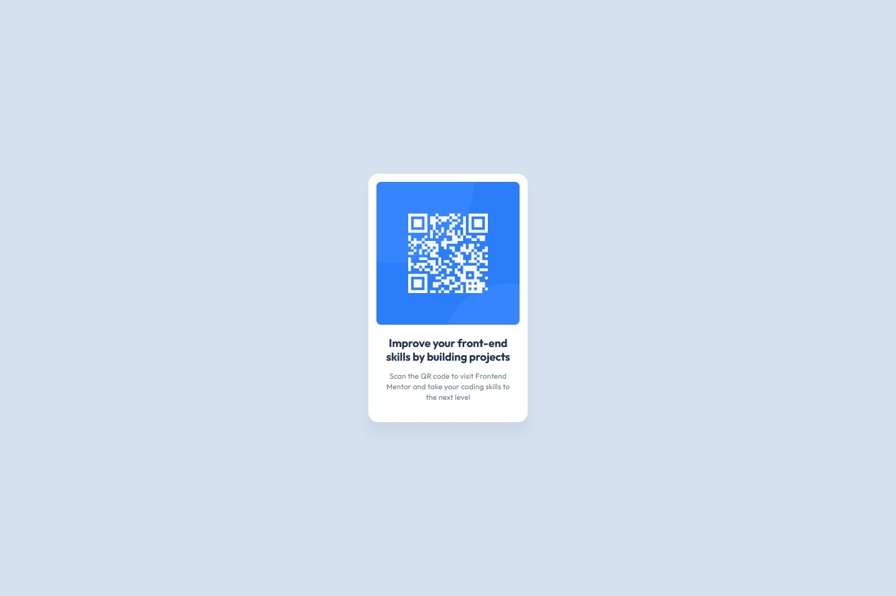

# Frontend Mentor - QR code component solution

Это моё решение задачи [QR code component challenge на Frontend Mentor](https://www.frontendmentor.io/challenges/qr-code-component-iux_sIO_H). Задание отлично подходит для отработки базовой вёрстки и внимательной работы с отступами, шрифтами и тенями.

## 📸 Скриншот

## 🔗 Ссылки

- Репозиторий: [GitHub Repository](https://github.com/Rud1K3nt37/fem-qr-code-component.git)  
- Демо-версия: локально (не опубликовано онлайн)

## ⚙️ Мой процесс

### Использовано:

- Семантическая HTML5-разметка
- CSS custom properties (переменные)
- Flexbox
- Мобильный подход (mobile-first)
- Пиксель-перфект по макету

### Что я изучил:

- Работа с `box-shadow` и его точной прозрачностью
- Применение `object-fit`, `object-position` для картинок
- Корректное использование единиц `rem` и относительных размеров
- Уверенная работа с отступами, `gap`, `padding`, `border-radius`

### Что буду развивать дальше:

- Хочу углубиться в адаптивную вёрстку (media queries)
- Освоить CSS Grid
- Начать практиковаться в более сложных компонентах

## 🙋‍♂️ Автор

- Frontend Mentor – [@Rud1K3nt37](https://www.frontendmentor.io/profile/Rud1K3nt37)
- GitHub – [@Rud1K3nt37](https://github.com/Rud1K3nt37)

## 🙌 Благодарности

Спасибо комьюнити Frontend Mentor за крутые задания. Это был мой первый проект на платформе, но точно не последний.
